# Krushi Supabase Backend Migration & SQL Database Architecture

This document provides a production-grade, highly scalable, and secure **Supabase database migration architecture** for the **Krushi** farming application. It contains the complete set of SQL migration scripts, database structures, security configurations, and performance tuning steps mapped from the frontend analysis.

---

## 1. Migration Order

To avoid database compilation issues and circular dependency errors, migrations must be executed in the following sequential order:

```mermaid
graph TD
    A[001_create_users.sql] --> B[002_create_posts.sql]
    A --> F[006_create_farming_problems.sql]
    A --> H[008_create_chats.sql]
    A --> K[011_create_followers.sql]
    
    B --> C[003_create_comments.sql]
    B --> D[004_create_likes.sql]
    B --> E[005_create_saved_posts.sql]
    B --> L[012_create_reports.sql]
    
    H --> I[009_create_messages.sql]
    A --> I
    
    B --> J[010_create_notifications.sql]
    A --> J
    
    G[007_create_marketplace_products.sql]
    M[013_create_weather_cache.sql]
    
    Sub1[Indexes & Triggers] --> N[014_create_indexes.sql]
    Sub1 --> O[017_create_triggers.sql]
    
    Sub2[Security Policies] --> P[015_create_rls_policies.sql]
    Sub2 --> Q[016_create_storage_policies.sql]
    
    Seed[Data Seeding] --> R[018_seed_marketplace.sql]
```



1. **`001_create_users.sql`**: Core profile schema mapping to auth IDs.
2. **`002_create_posts.sql`**: Social community updates.
3. **`003_create_comments.sql`**: Post interaction replies.
4. **`004_create_likes.sql`**: Post reactions.
5. **`005_create_saved_posts.sql`**: Bookmarked agricultural posts.
6. **`006_create_farming_problems.sql`**: Personal farm logging telemetry.
7. **`007_create_marketplace_products.sql`**: Products catalog directory.
8. **`008_create_chats.sql`**: Conversation room identifiers.
9. **`009_create_messages.sql`**: Direct message transcripts.
10. **`010_create_notifications.sql`**: Weather, connection, reaction, and market alerts.
11. **`011_create_followers.sql`**: User social graphs.
12. **`012_create_reports.sql`**: Moderation/reporting dashboard.
13. **`013_create_weather_cache.sql`**: Met cache repository.
14. **`014_create_indexes.sql`**: Query performance improvements.
15. **`015_create_rls_policies.sql`**: Table-level data security.
16. **`016_create_storage_policies.sql`**: Storage objects security.
17. **`017_create_triggers.sql`**: Profile synchronization.
18. **`018_seed_marketplace.sql`**: Seed values for products and weather.

---

## 2. SQL Migration Files

### 001_create_users.sql
```sql
-- Create public.users profile table linking directly to auth.users
CREATE TABLE IF NOT EXISTS public.users (
    id UUID PRIMARY KEY REFERENCES auth.users(id) ON DELETE CASCADE,
    name TEXT NOT NULL DEFAULT 'New Farmer',
    phone TEXT NOT NULL UNIQUE,
    email TEXT UNIQUE,
    avatar_url TEXT,
    village TEXT,
    district TEXT,
    state TEXT,
    farm_type TEXT CHECK (farm_type IN ('Organic', 'Traditional', 'Modern', 'Organic & Traditional')),
    experience_years INTEGER CHECK (experience_years >= 0),
    bio TEXT,
    primary_crops TEXT[] DEFAULT '{}',
    medicines_used TEXT[] DEFAULT '{}',
    is_verified BOOLEAN DEFAULT false,
    created_at TIMESTAMPTZ NOT NULL DEFAULT now()
);

-- Comments on table columns for developers
COMMENT ON COLUMN public.users.id IS 'References the auth.users identifier';
COMMENT ON COLUMN public.users.primary_crops IS 'Array of primary crops grown by the farmer';
```

### 002_create_posts.sql
```sql
CREATE TABLE IF NOT EXISTS public.posts (
    id UUID PRIMARY KEY DEFAULT gen_random_uuid(),
    user_id UUID NOT NULL REFERENCES public.users(id) ON DELETE CASCADE,
    content TEXT NOT NULL,
    image_url TEXT,
    category TEXT NOT NULL CHECK (category IN ('crop', 'pest', 'tip', 'weather', 'market')),
    crop_tag TEXT,
    created_at TIMESTAMPTZ NOT NULL DEFAULT now()
);
```

### 003_create_comments.sql
```sql
CREATE TABLE IF NOT EXISTS public.comments (
    id UUID PRIMARY KEY DEFAULT gen_random_uuid(),
    post_id UUID NOT NULL REFERENCES public.posts(id) ON DELETE CASCADE,
    user_id UUID NOT NULL REFERENCES public.users(id) ON DELETE CASCADE,
    content TEXT NOT NULL CHECK (char_length(trim(content)) > 0),
    created_at TIMESTAMPTZ NOT NULL DEFAULT now()
);
```

### 004_create_likes.sql
```sql
CREATE TABLE IF NOT EXISTS public.likes (
    id UUID PRIMARY KEY DEFAULT gen_random_uuid(),
    post_id UUID NOT NULL REFERENCES public.posts(id) ON DELETE CASCADE,
    user_id UUID NOT NULL REFERENCES public.users(id) ON DELETE CASCADE,
    created_at TIMESTAMPTZ NOT NULL DEFAULT now(),
    CONSTRAINT likes_post_user_unique UNIQUE (post_id, user_id)
);
```

### 005_create_saved_posts.sql
```sql
CREATE TABLE IF NOT EXISTS public.saved_posts (
    id UUID PRIMARY KEY DEFAULT gen_random_uuid(),
    post_id UUID NOT NULL REFERENCES public.posts(id) ON DELETE CASCADE,
    user_id UUID NOT NULL REFERENCES public.users(id) ON DELETE CASCADE,
    created_at TIMESTAMPTZ NOT NULL DEFAULT now(),
    CONSTRAINT saved_posts_post_user_unique UNIQUE (post_id, user_id)
);
```

### 006_create_farming_problems.sql
```sql
CREATE TABLE IF NOT EXISTS public.farming_problems (
    id UUID PRIMARY KEY DEFAULT gen_random_uuid(),
    user_id UUID NOT NULL REFERENCES public.users(id) ON DELETE CASCADE,
    crop_name TEXT NOT NULL CHECK (char_length(trim(crop_name)) > 0),
    area TEXT NOT NULL, -- e.g. '5 Acres'
    soil_type TEXT,
    water_source TEXT,
    description TEXT,
    image_url TEXT,
    created_at TIMESTAMPTZ NOT NULL DEFAULT now()
);
```

### 007_create_marketplace_products.sql
```sql
CREATE TABLE IF NOT EXISTS public.marketplace_products (
    id UUID PRIMARY KEY DEFAULT gen_random_uuid(),
    name TEXT NOT NULL,
    disease_target TEXT,
    description TEXT NOT NULL,
    use_case TEXT NOT NULL,
    how_to_use TEXT NOT NULL,
    price_in_inr NUMERIC(10,2) NOT NULL CHECK (price_in_inr >= 0),
    warning_text TEXT,
    safety_text TEXT,
    quantity_unit TEXT NOT NULL, -- e.g. '45kg Bag', '500g Pack'
    rating NUMERIC(2,1) DEFAULT 5.0 CHECK (rating >= 1.0 AND rating <= 5.0),
    reviews_count INTEGER DEFAULT 0 CHECK (reviews_count >= 0),
    category TEXT NOT NULL CHECK (category IN ('fertilizer', 'pesticide', 'fungicide', 'seeds', 'tools', 'tractors', 'irrigation', 'organic')),
    image_url TEXT NOT NULL,
    created_at TIMESTAMPTZ NOT NULL DEFAULT now()
);
```

### 008_create_chats.sql
```sql
CREATE TABLE IF NOT EXISTS public.chats (
    id UUID PRIMARY KEY DEFAULT gen_random_uuid(),
    created_at TIMESTAMPTZ NOT NULL DEFAULT now()
);

-- Join table to map participants inside a private conversation room
CREATE TABLE IF NOT EXISTS public.chat_participants (
    id UUID PRIMARY KEY DEFAULT gen_random_uuid(),
    chat_id UUID NOT NULL REFERENCES public.chats(id) ON DELETE CASCADE,
    user_id UUID NOT NULL REFERENCES public.users(id) ON DELETE CASCADE,
    created_at TIMESTAMPTZ NOT NULL DEFAULT now(),
    CONSTRAINT chat_participants_chat_user_unique UNIQUE (chat_id, user_id)
);
```

### 009_create_messages.sql
```sql
CREATE TABLE IF NOT EXISTS public.messages (
    id UUID PRIMARY KEY DEFAULT gen_random_uuid(),
    chat_id UUID NOT NULL REFERENCES public.chats(id) ON DELETE CASCADE,
    sender_id UUID NOT NULL REFERENCES public.users(id) ON DELETE CASCADE,
    content TEXT NOT NULL CHECK (char_length(trim(content)) > 0 OR media_url IS NOT NULL),
    media_url TEXT,
    created_at TIMESTAMPTZ NOT NULL DEFAULT now()
);
```

### 010_create_notifications.sql
```sql
CREATE TABLE IF NOT EXISTS public.notifications (
    id UUID PRIMARY KEY DEFAULT gen_random_uuid(),
    user_id UUID NOT NULL REFERENCES public.users(id) ON DELETE CASCADE,
    type TEXT NOT NULL CHECK (type IN ('alert', 'comment', 'like', 'system', 'follower', 'message')),
    title TEXT NOT NULL,
    message TEXT NOT NULL,
    read BOOLEAN NOT NULL DEFAULT false,
    related_user_id UUID REFERENCES public.users(id) ON DELETE SET NULL,
    related_post_id UUID REFERENCES public.posts(id) ON DELETE CASCADE,
    created_at TIMESTAMPTZ NOT NULL DEFAULT now()
);
```

### 011_create_followers.sql
```sql
CREATE TABLE IF NOT EXISTS public.followers (
    id UUID PRIMARY KEY DEFAULT gen_random_uuid(),
    follower_id UUID NOT NULL REFERENCES public.users(id) ON DELETE CASCADE,
    following_id UUID NOT NULL REFERENCES public.users(id) ON DELETE CASCADE,
    status TEXT NOT NULL DEFAULT 'approved' CHECK (status IN ('pending', 'approved')),
    created_at TIMESTAMPTZ NOT NULL DEFAULT now(),
    CONSTRAINT followers_relationship_unique UNIQUE (follower_id, following_id),
    CONSTRAINT followers_cannot_follow_self CHECK (follower_id <> following_id)
);
```

### 012_create_reports.sql
```sql
CREATE TABLE IF NOT EXISTS public.reports (
    id UUID PRIMARY KEY DEFAULT gen_random_uuid(),
    reporter_id UUID NOT NULL REFERENCES public.users(id) ON DELETE CASCADE,
    reported_post_id UUID REFERENCES public.posts(id) ON DELETE CASCADE,
    reported_user_id UUID REFERENCES public.users(id) ON DELETE CASCADE,
    reason TEXT NOT NULL CHECK (char_length(trim(reason)) > 10),
    status TEXT NOT NULL DEFAULT 'pending' CHECK (status IN ('pending', 'investigated', 'dismissed')),
    created_at TIMESTAMPTZ NOT NULL DEFAULT now(),
    CONSTRAINT reports_reported_target_exist CHECK (reported_post_id IS NOT NULL OR reported_user_id IS NOT NULL)
);
```

### 013_create_weather_cache.sql
```sql
CREATE TABLE IF NOT EXISTS public.weather_cache (
    id UUID PRIMARY KEY DEFAULT gen_random_uuid(),
    city TEXT NOT NULL UNIQUE,
    temp NUMERIC(4,1) NOT NULL,
    humidity INTEGER NOT NULL CHECK (humidity >= 0 AND humidity <= 100),
    rain_chance INTEGER NOT NULL CHECK (rain_chance >= 0 AND rain_chance <= 100),
    condition TEXT NOT NULL,
    updated_at TIMESTAMPTZ NOT NULL DEFAULT now()
);
```

---

## 3. Row Level Security (RLS) Policies

All tables inside the `public` schema have Row Level Security enabled. Policies ensure strict separation of concerns, protecting farmer profiles, messaging conversations, telemetry logs, and diagnostic activities.

```sql
-- ENABLE RLS ON ALL TABLES
ALTER TABLE public.users ENABLE ROW LEVEL SECURITY;
ALTER TABLE public.posts ENABLE ROW LEVEL SECURITY;
ALTER TABLE public.comments ENABLE ROW LEVEL SECURITY;
ALTER TABLE public.likes ENABLE ROW LEVEL SECURITY;
ALTER TABLE public.saved_posts ENABLE ROW LEVEL SECURITY;
ALTER TABLE public.farming_problems ENABLE ROW LEVEL SECURITY;
ALTER TABLE public.marketplace_products ENABLE ROW LEVEL SECURITY;
ALTER TABLE public.chats ENABLE ROW LEVEL SECURITY;
ALTER TABLE public.chat_participants ENABLE ROW LEVEL SECURITY;
ALTER TABLE public.messages ENABLE ROW LEVEL SECURITY;
ALTER TABLE public.notifications ENABLE ROW LEVEL SECURITY;
ALTER TABLE public.followers ENABLE ROW LEVEL SECURITY;
ALTER TABLE public.reports ENABLE ROW LEVEL SECURITY;
ALTER TABLE public.weather_cache ENABLE ROW LEVEL SECURITY;
```

### Users Profile Policies
- **Select**: Any authenticated user can view farmer profiles to build community networking.
- **Update**: Restricted only to the profile owner matching their authenticated ID.
```sql
CREATE POLICY "Public profiles read access" ON public.users
    FOR SELECT TO authenticated USING (true);

CREATE POLICY "Profile update access for owner" ON public.users
    FOR UPDATE TO authenticated USING (auth.uid() = id);
```

### Community Posts Policies
- **Select**: Any authenticated user can view posts.
- **Insert**: Users can only create posts matching their user ID.
- **Update/Delete**: Restricts modifications exclusively to the post owner.
```sql
CREATE POLICY "Posts read access for authenticated users" ON public.posts
    FOR SELECT TO authenticated USING (true);

CREATE POLICY "Posts write access for authenticated creator" ON public.posts
    FOR INSERT TO authenticated WITH CHECK (auth.uid() = user_id);

CREATE POLICY "Posts update/delete access for owner" ON public.posts
    FOR ALL TO authenticated USING (auth.uid() = user_id);
```

### Comments, Likes, and Bookmarks Policies
- **Select**: Viewable to all authenticated users.
- **Insert/Delete**: Requires the actions to be executed under the logged-in session ID.
```sql
-- Comments Policies
CREATE POLICY "Comments read access" ON public.comments FOR SELECT TO authenticated USING (true);
CREATE POLICY "Comments insert access" ON public.comments FOR INSERT TO authenticated WITH CHECK (auth.uid() = user_id);
CREATE POLICY "Comments delete access" ON public.comments FOR DELETE TO authenticated USING (auth.uid() = user_id);

-- Likes Policies
CREATE POLICY "Likes read access" ON public.likes FOR SELECT TO authenticated USING (true);
CREATE POLICY "Likes insert access" ON public.likes FOR INSERT TO authenticated WITH CHECK (auth.uid() = user_id);
CREATE POLICY "Likes delete access" ON public.likes FOR DELETE TO authenticated USING (auth.uid() = user_id);

-- Saved Posts Policies
CREATE POLICY "Saved posts access for owner only" ON public.saved_posts
    FOR ALL TO authenticated USING (auth.uid() = user_id) WITH CHECK (auth.uid() = user_id);
```

### Farming Problems (Telemetry Records) Policies
- **Access Control**: Users can view and manage their own logs. Connection lookup allows followers to view details if connected.
```sql
CREATE POLICY "Farming logs select access for owner and approved followers" ON public.farming_problems
    FOR SELECT TO authenticated USING (
        auth.uid() = user_id OR 
        EXISTS (
            SELECT 1 FROM public.followers 
            WHERE follower_id = auth.uid() AND following_id = farming_problems.user_id AND status = 'approved'
        )
    );

CREATE POLICY "Farming logs modify access for owner" ON public.farming_problems
    FOR ALL TO authenticated USING (auth.uid() = user_id) WITH CHECK (auth.uid() = user_id);
```

### Private Messaging Policies
- **Access Control**: Users can see chat lists, participants, and messages only if their `user_id` matches a participant record.
```sql
-- Chat Participant Policies
CREATE POLICY "Chat participants read access" ON public.chat_participants
    FOR SELECT TO authenticated USING (
        user_id = auth.uid() OR
        chat_id IN (SELECT chat_id FROM public.chat_participants WHERE user_id = auth.uid())
    );

CREATE POLICY "Chat participants insert access" ON public.chat_participants
    FOR INSERT TO authenticated WITH CHECK (user_id = auth.uid());

-- Message Policies
CREATE POLICY "Message select access for thread participants" ON public.messages
    FOR SELECT TO authenticated USING (
        EXISTS (SELECT 1 FROM public.chat_participants WHERE chat_id = messages.chat_id AND user_id = auth.uid())
    );

CREATE POLICY "Message insert access for sender" ON public.messages
    FOR INSERT TO authenticated WITH CHECK (
        auth.uid() = sender_id AND
        EXISTS (SELECT 1 FROM public.chat_participants WHERE chat_id = messages.chat_id AND user_id = auth.uid())
    );
```

### Notifications & Followers Policies
- **Access Control**: Notifications are restricted to the recipient. Connection entries can be modified by the sender or target.
```sql
-- Notifications
CREATE POLICY "Notifications select/update access for owner" ON public.notifications
    FOR ALL TO authenticated USING (auth.uid() = user_id) WITH CHECK (auth.uid() = user_id);

-- Followers
CREATE POLICY "Followers read access" ON public.followers FOR SELECT TO authenticated USING (true);
CREATE POLICY "Followers insert access for sender" ON public.followers FOR INSERT TO authenticated WITH CHECK (auth.uid() = follower_id);
CREATE POLICY "Followers update/delete access for participants" ON public.followers 
    FOR ALL TO authenticated USING (auth.uid() = follower_id OR auth.uid() = following_id);
```

### Reports & Marketplace Policies
- **Marketplace**: Read-only access for all, write access restricted to database administrators.
- **Reports**: Any user can submit reports, but only administrators can view/triage them.
```sql
-- Marketplace Products
CREATE POLICY "Marketplace read access" ON public.marketplace_products FOR SELECT USING (true);
CREATE POLICY "Marketplace write restricted to admins" ON public.marketplace_products 
    FOR ALL USING (false); -- Requires backend DB override or service_role bypass for admins

-- Weather Cache
CREATE POLICY "Weather read access" ON public.weather_cache FOR SELECT USING (true);

-- Moderation Reports
CREATE POLICY "Reports insert access for reporter" ON public.reports 
    FOR INSERT TO authenticated WITH CHECK (auth.uid() = reporter_id);
CREATE POLICY "Reports read restricted to admins" ON public.reports 
    FOR SELECT USING (false); -- Admin roles only
```

---

## 4. Storage Policies

Buckets must be configured in Supabase Storage with Row Level Security enabled. The target buckets are:
1. **`avatars`**: Public profile photos.
2. **`posts`**: Public community feeds.
3. **`farms`**: Diagnostic/telemetry photos.
4. **`chat_media`**: Private message attachments.

```sql
-- Bucket Initializations inside storage schema
INSERT INTO storage.buckets (id, name, public) 
VALUES 
    ('avatars', 'avatars', true),
    ('posts', 'posts', true),
    ('farms', 'farms', true),
    ('chat_media', 'chat_media', false)
ON CONFLICT (id) DO NOTHING;
```

### Storage Security Policies:

```sql
-- Avatars Policies
CREATE POLICY "Avatar public read access" ON storage.objects 
    FOR SELECT USING (bucket_id = 'avatars');

CREATE POLICY "Avatar write access for owner" ON storage.objects 
    FOR ALL TO authenticated USING (
        bucket_id = 'avatars' AND 
        (storage.foldername(name))[1] = auth.uid()::text
    );

-- Posts Policies
CREATE POLICY "Posts image public read access" ON storage.objects 
    FOR SELECT USING (bucket_id = 'posts');

CREATE POLICY "Posts image write access for authenticated users" ON storage.objects 
    FOR INSERT TO authenticated WITH CHECK (
        bucket_id = 'posts' AND 
        (storage.foldername(name))[1] = auth.uid()::text
    );

-- Farms Policies
CREATE POLICY "Farm image read access for connections" ON storage.objects 
    FOR SELECT TO authenticated USING (
        bucket_id = 'farms' AND (
            (storage.foldername(name))[1] = auth.uid()::text OR
            EXISTS (
                SELECT 1 FROM public.followers 
                WHERE follower_id = auth.uid() AND following_id = (storage.foldername(name))[1]::uuid AND status = 'approved'
            )
        )
    );

CREATE POLICY "Farm image upload access for owner" ON storage.objects 
    FOR ALL TO authenticated USING (
        bucket_id = 'farms' AND 
        (storage.foldername(name))[1] = auth.uid()::text
    );

-- Chat Media Policies
CREATE POLICY "Chat media upload access for participants" ON storage.objects 
    FOR ALL TO authenticated USING (
        bucket_id = 'chat_media' AND 
        EXISTS (
            SELECT 1 FROM public.chat_participants 
            WHERE chat_id::text = (storage.foldername(name))[1] AND user_id = auth.uid()
        )
    );
```

---

## 5. Trigger Functions

### Automatic Profile Synchronization on Sign-Up
To automatically sync new accounts created via the mobile SMS OTP flow to the `public.users` profile table, we establish a Postgres trigger:

```sql
-- 017_create_triggers.sql

-- Trigger function definitions
CREATE OR REPLACE FUNCTION public.handle_new_user()
RETURNS trigger AS $$
DECLARE
    phone_number TEXT;
    full_name TEXT;
    avatar_link TEXT;
BEGIN
    phone_number := new.phone;
    full_name := COALESCE(new.raw_user_meta_data->>'name', 'New Farmer');
    avatar_link := COALESCE(new.raw_user_meta_data->>'avatar_url', 'https://i.pravatar.cc/150');

    INSERT INTO public.users (id, name, phone, avatar_url, is_verified)
    VALUES (
        new.id,
        full_name,
        phone_number,
        avatar_link,
        false
    )
    ON CONFLICT (id) DO UPDATE 
    SET 
        phone = EXCLUDED.phone,
        name = COALESCE(public.users.name, EXCLUDED.name),
        avatar_url = COALESCE(public.users.avatar_url, EXCLUDED.avatar_url);
        
    RETURN new;
END;
$$ LANGUAGE plpgsql SECURITY DEFINER;

-- Bind trigger to auth.users table
DROP TRIGGER IF EXISTS on_auth_user_created ON auth.users;
CREATE TRIGGER on_auth_user_created
  AFTER INSERT ON auth.users
  FOR EACH ROW EXECUTE FUNCTION public.handle_new_user();
```

---

## 6. Realtime Setup

Supabase Realtime works by monitoring changes in the database replication slots. To enable low-latency broadcasts for comments, likes, messages, and notifications, configure the publication list:

```sql
-- Clear previous publications
ALTER PUBLICATION supabase_realtime DROP TABLE IF EXISTS 
    public.likes, 
    public.comments, 
    public.messages, 
    public.notifications;

-- Create/Extend the realtime publication
ALTER PUBLICATION supabase_realtime ADD TABLE 
    public.likes, 
    public.comments, 
    public.messages, 
    public.notifications;
```

---

## 7. Seed Data

### 018_seed_marketplace.sql
```sql
-- Insert Marketplace Product Inventory Catalog
INSERT INTO public.marketplace_products (name, disease_target, description, use_case, how_to_use, price_in_inr, warning_text, safety_text, quantity_unit, rating, reviews_count, category, image_url) 
VALUES 
    (
        'IFFCO Urea Fertilizer', 
        'Nitrogen Deficiency', 
        'High-quality nitrogenous fertilizer designed to promote green vegetative growth and leafy crop yield.', 
        'Crop Growth', 
        'Broadcast evenly across the soil field pre-watering, or dissolve 15g/L for leaf drenching.', 
        266.50, 
        'Excess use can cause chemical leaf burns and dry roots.', 
        'Wear gloves and protective goggles during distribution.', 
        '45kg Bag', 
        4.8, 
        120, 
        'fertilizer', 
        'https://images.unsplash.com/photo-1599599810769-bcde5a160d32?auto=format&fit=crop&q=80&w=400'
    ),
    (
        'Mancozeb Fungicide (75% WP)', 
        'Early & Late Blight', 
        'Broad-spectrum contact fungicide designed to protect fruit and vegetable plants from blight and mildew.', 
        'Fungus Control', 
        'Mix 2.5 grams per Liter of clean water. Spray thoroughly on crop leaves.', 
        350.00, 
        'Avoid breathing in powder dust. Toxic to aquatic organisms.', 
        'Use dust protection masks and hand protection apparel.', 
        '500g Pack', 
        4.5, 
        85, 
        'fungicide', 
        'https://images.unsplash.com/photo-1592841200221-a6898f307baa?auto=format&fit=crop&q=80&w=400'
    ),
    (
        'Chlorpyrifos Insecticide (20% EC)', 
        'Termites & Shoot Borer', 
        'Broad-spectrum chemical insecticide for soil and foliage insect protection.', 
        'Pest Control', 
        'Mix 3-4 ml per Liter of water. Perform root drench or light leaf misting.', 
        420.00, 
        'Flammable liquid. Keep away from heat sources and open flames.', 
        'Ensure full body coverage and protective goggles during spraying.', 
        '1 Liter Bottle', 
        4.2, 
        45, 
        'pesticide', 
        'https://images.unsplash.com/photo-1625246333195-78d9c38ad449?auto=format&fit=crop&q=80&w=400'
    ),
    (
        'Premium Organic Cotton Seeds (BT)', 
        'Lepidopteran Pests Resistance', 
        'Premium hybrid cotton seeds optimized for Indian soil conditions. Offers defense against bollworms.', 
        'Sowing', 
        'Plant seeds 2cm deep in aerated warm soil, spaced 45cm apart.', 
        860.00, 
        'Do not expose seeds to water logging during germinating stages.', 
        'Keep in cool, dry storage conditions prior to field sowing.', 
        '450g Pack', 
        4.7, 
        198, 
        'seeds', 
        'https://images.unsplash.com/photo-1574943320219-553eb213f72d?auto=format&fit=crop&q=80&w=400'
    ),
    (
        'Fuji Drip Irrigation Lateral Pipe', 
        'Water Shortages', 
        'Heavy-duty UV-stabilized drip lines for efficient micro-irrigation systems.', 
        'Irrigation', 
        'Lay pipes along rows and connect emitters to roots.', 
        1250.00, 
        'Do not bend at sharp angles or run over with heavy machinery.', 
        'Flush clean water regularly to prevent soil clogging.', 
        '100m Roll', 
        4.6, 
        64, 
        'irrigation', 
        'https://images.unsplash.com/photo-1574323347407-f5e1ad6d020b?auto=format&fit=crop&q=80&w=400'
    );

-- Seed Weather Caches for India
INSERT INTO public.weather_cache (city, temp, humidity, rain_chance, condition) 
VALUES 
    ('Ahmedabad', 38.5, 45, 10, '🌤'),
    ('Surat', 34.2, 65, 20, '🌤'),
    ('Rajkot', 39.0, 40, 5, '☀️'),
    ('Pune', 31.5, 55, 30, '⛅'),
    ('Bardoli', 33.8, 70, 45, '🌧')
ON CONFLICT (city) DO UPDATE 
SET 
    temp = EXCLUDED.temp,
    humidity = EXCLUDED.humidity,
    rain_chance = EXCLUDED.rain_chance,
    condition = EXCLUDED.condition,
    updated_at = now();
```

---

## 8. Indexing Strategy

To keep database lookups performant on high-traffic mobile networks, indexing targets primary fields used in filters and joins:

```sql
-- 014_create_indexes.sql

-- 1. Feed Pagination Optimization
CREATE INDEX IF NOT EXISTS idx_posts_created_at ON public.posts(created_at DESC);

-- 2. Post Lookup joined by User ID
CREATE INDEX IF NOT EXISTS idx_posts_user_id ON public.posts(user_id);

-- 3. Composite Indexes for likes and saves
CREATE INDEX IF NOT EXISTS idx_likes_post_user ON public.likes(post_id, user_id);
CREATE INDEX IF NOT EXISTS idx_saved_posts_post_user ON public.saved_posts(post_id, user_id);

-- 4. Social Connections Optimization
CREATE INDEX IF NOT EXISTS idx_followers_rel ON public.followers(follower_id, following_id);
CREATE INDEX IF NOT EXISTS idx_followers_following ON public.followers(following_id);

-- 5. Realtime Notifications Queue
CREATE INDEX IF NOT EXISTS idx_notifications_user_read ON public.notifications(user_id, read, created_at DESC);

-- 6. Direct Message Sorts
CREATE INDEX IF NOT EXISTS idx_messages_chat_created ON public.messages(chat_id, created_at DESC);

-- 7. Full-text Search Index on public.users
CREATE INDEX IF NOT EXISTS idx_users_location_farm ON public.users(location, farm_type);
```

### Query Optimization Analysis:
- **`idx_posts_created_at`**: Allows pagination queries like `LIMIT 10 OFFSET X` to skip scanning the entire table.
- **`idx_likes_post_user`**: Speeds up verification checks that determine if the user has liked a post.
- **`idx_followers_rel`**: Used in RLS checks when querying connection telemetry logs.

---

## 9. Security Notes

1. **SQL Injection Mitigation**: Endpoints are queried via Supabase's PostgREST client API using parameterized objects, eliminating risks from manual string concatenation.
2. **Defensive CASCADE Policy**: Deleting user accounts deletes related user rows on cascade in the dependent tables (`posts`, `comments`, `likes`, `saved_posts`, `farming_problems`, `chat_participants`), cleaning up old storage references.
3. **Storage Sanitization**: RLS restricts uploads by requiring folder routes to match the active user ID (`(storage.foldername(name))[1] = auth.uid()::text`), preventing malicious scripts from overwriting other users' photos.
4. **Trigger Security**: The profile synchronization trigger function is defined with `SECURITY DEFINER`. This runs the sync query using administrator access levels (bypassing normal client RLS), which is necessary because the public `users` write happens during the `auth.users` registration flow before the client-facing JWT is fully initialized.

---

## 10. Scalability Notes

1. **Full-Text Searching**: For searching farmers, avoid `LIKE '%search%'` queries, which trigger slow sequential table scans. Use Postgres PG_TRGM (Trigram Indexes) or Supabase's full-text search vector indexes:
   ```sql
   CREATE EXTENSION IF NOT EXISTS pg_trgm;
   CREATE INDEX IF NOT EXISTS idx_users_name_trgm ON public.users USING gin (name gin_trgm_ops);
   ```
2. **Chat Scale Concerns**: In-memory queries on large `messages` tables can be slow. Realtime subscriptions should always be scoped to specific channels via `chat_id` filters, rather than listening to the entire table.
3. **Cursor-Based Pagination**: Avoid offset-based pagination (`OFFSET 1000`) for large feeds, as Postgres must scan all previous records. Implement cursor-based pagination using the post's creation timestamp:
   ```javascript
   supabase.from('posts').select('*').lt('created_at', last_loaded_timestamp).limit(10);
   ```
4. **Weather Caching**: Storing regional coordinates/city weather in `weather_cache` prevents overloading third-party APIs (e.g., OpenWeatherMap), keeping the app responsive.
5. **Connection Count Caching**: When listing public profile stats, do not run `count(*)` counts across tables dynamically. In high-traffic scenarios, cache these counts inside columns in the `users` profile table (e.g., `total_posts`, `followers_count`), incrementing them via database triggers.
